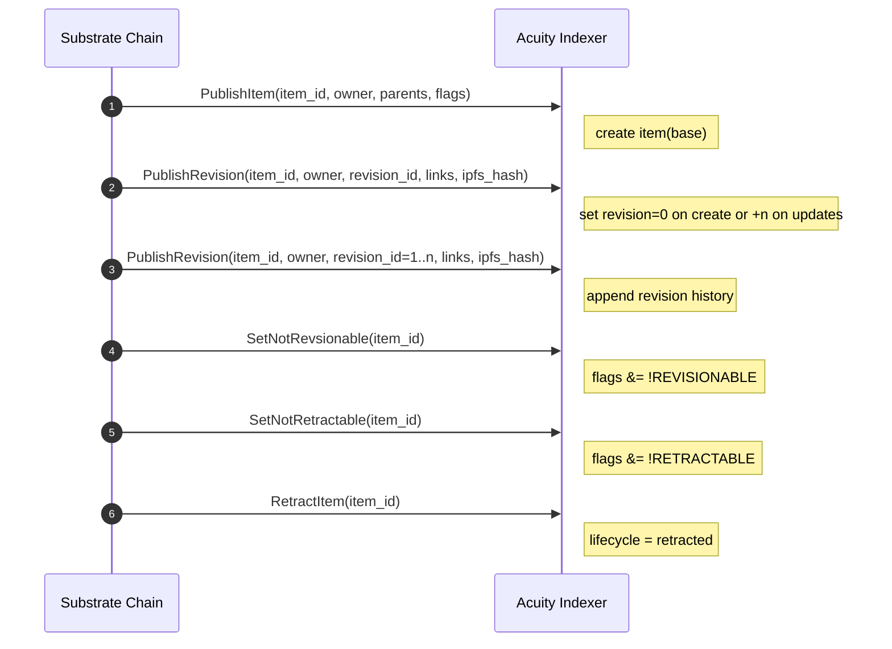

# Indexing Workflow

`pallet-content` does not persist parent/links/`ipfs_hash` in storage. These are
part of emitted events so the indexer is the source of truth for those fields.

## Recommended workflow for `acuity-index`

1. Subscribe to all block events and filter for pallet `content` events.
2. Materialize a local item aggregate from event streams:
   - `PublishItem` creates the canonical item record.
   - `PublishRevision` appends revision metadata.
   - `RetractItem` updates lifecycle state.
   - `SetNotRevsionable`/`SetNotRetractable` update item capability flags.
3. Expose API methods keyed by `item_id` and `revision_id`.

## Event processing pattern

## Practical tips

- Keep a durable unique index on `(item_id, revision_id)`.
- Store `parents` and `links` as arrays/lists per revision.
- Preserve raw event ordering inside the same block for deterministic projections.
- Treat `RevisionIdOverflow` as an alert condition; it signals corrupted or malicious
  on-chain state and should be surfaced to operators.
